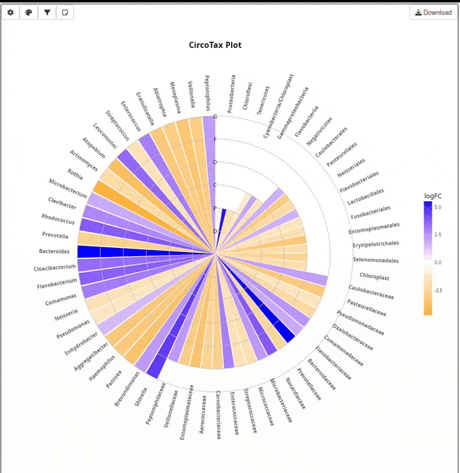

# CircoTax Shiny

The CircoTax Shiny R module provides an interactive interface for visualizing circular taxonomy plots using the [CircoTax](https://github.com/matteoramazzotti/CircoTax) package. It is designed to be embedded inside larger Shiny R applications and support extensive customization of plot appearance, colors, filters, annotations, and taxonomic settings.

A live demo for this application is available at [shinyapps.io](https://lorenzocasbarra.shinyapps.io/circotax-dashboard/).


<p align="center">
	
</p>

## How to install

To install with `devtools` :

```r
	library("devtools")
	install_github("lorenzocasbarra/CircoTaxShiny")
```


## `CircoTaxShinyUI()`

`CircoTaxShinyUI()` defines the UI for the CircoTax module, including styling, JavaScript, panel toggles, and the main plot output.

**Usage:**
```r
ui <- fluidPage(
  CircoTaxShinyUI("circotax_ui", disableSettings=FALSE)
)
```

### Arguments

- `id`: Module namespace identifier.
- `disableSettings`: Logical, hide all settings when TRUE. Default: FALSE.

## `CircoTaxServer()`

`CircoTaxServer()` implements interactivity, updates, rendering and download logic.

**Usage:**
```r
server <- function(input, output, session) {
	data_reactive <- reactive({
		read.delim(system.file("extdata", "circotax_example_1.txt", package = "circotax"), sep = "\t")
	})
	CircoTaxServer(
		"circotax_ui",
		input = input,
		output = output,
		session = session,
		data = data_reactive
	)
}
```

### Arguments

- `input`: Standard Shiny module argument.
- `output`: Standard Shiny module argument.
- `session`: Standard Shiny module argument.
- `data`: A reactive expression returning a data.frame compatible with `circotax::CircoTax()`.
- `titleText`: Optional reactive providing a plot title.
- `size_taxon_circo`: Optional reactive specifying taxon size scaling.
- `fill_text`: Optional reactive specifying the text fill field.
- `ramp`: Optional reactive defining the color ramp.
- `fc_col`: Optional reactive indicating the fold-change (or value) column.
- `sort`: Optional reactive specifying sorting behavior.
- `collapse_ranks`: Optional reactive controlling taxonomic rank collapsing.
- `mode`: Optional reactive defining `'single'` or `'multi'` mode.
- `tax_column_start`: Optional reactive giving starting taxon column index.
- `tax_column_end`: Optional reactive giving ending taxon column index.
- `renderWidth`: Pixel width for the generated plot.
- `renderHeight`: Pixel height for the generated plot.

## Using CircoTaxShinyUI() as a Widget

CircoTax Shiny can be embedded inside larger Shiny R applications. This is  done by calling:

```r
	CircoTaxShinyUI("circotax_ui", disableSettings = FALSE)
```

When `disableSettings = FALSE`, the module displays the panels concerning general settings, palettes, filter and annotation and a download button.

Here's an example for a `server.R` file:


```r
	library("circotax.shiny")

	server <- function(input, output, session) {
	
		# Load dataset
		dataset <- reactive({
				read.delim(system.file("extdata", "circotax_example_1.txt", package = "circotax"), sep = "\t")
		})
		# Deploy module
		callModule(
			CircoTaxServer,
			"circotax_ui",
			dataset
		)
	}
```

Here's an example for a `ui.R` file:

```r
	library("circotax.shiny")

	ui <- fluidPage(
			
		h2(strong("CircoTax - Widget Example")),

  	# ---- CircoTax UI (Widget Mode) ----
		CircoTaxShinyUI("circotax_ui", disableSettings = FALSE)
	)
```


## Using CircoTaxShinyUI() With External Controls

In addition to the standard usage, where the CircoTax module provides its own settings panels, you can integrate the module into a larger Shiny dashboard and drive all plot parameters externally with a custom controller.

This is done by calling:

```r
	CircoTaxShinyUI("circotax_ui", disableSettings = TRUE)
```

When `disableSettings = TRUE`, the module hides the panels concerning general settings, palettes, filter and annotation, exposing only the plot output and download button.

This makes the CircoTax plot behave like a “render-only component” inside a more complex UI.

Here's an example for a `server.R` file:

```r
	library("circotax")
	library("circotax.shiny")

	# External controllers definition
	CircoTaxInputsController <- function(id) {

		moduleServer(id,function(input,output,session) {
			reactiveValues(
				title = reactive({input$title}),
				tax_column_start = reactive({input$tax_column_start}),
				tax_column_end = reactive({input$tax_column_end}),
				fill_text = reactive({input$fill_text}),
				collapse = reactive({input$collapse_ranks}),
				fc_col = reactive({input$fc_col}),
				ramp = reactive({c(input$color1,input$color2,input$color3)}),
				sortBy = reactive({input$sort}),
				size_taxon_circo = reactive({input$size_taxon_circo})
			)
		})
	}


	server <- function(input, output, session) {
		
		# External controllers for plot settings
		plotSettings <- CircoTaxInputsController("circotax-dash")

		# Load dataset
		dataset <- reactive({
    		read.delim(system.file("extdata", "circotax_example_1.txt", package = "circotax"), sep = "\t")
  		})
		head(dataset)
		# Select a mode compatible with your data
		mode<-reactive({
			"multi"
		})
	
		# Deploy module
		callModule(
			CircoTaxServer,
			"circotax_ui",
			dataset,
			renderWidth = 1000,
			renderHeight = 1000,
			titleText = plotSettings$title,
			size_taxon_circo = plotSettings$size_taxon_circo,
			fill_text = plotSettings$fill_text,
			ramp = plotSettings$ramp,
			fc_col = plotSettings$fc_col,
			sort = plotSettings$sortBy,
			collapse_ranks = plotSettings$collapse,
			mode = mode,
			tax_column_start = plotSettings$tax_column_start,
			tax_column_end = plotSettings$tax_column_end
  	)
	}

	
```

And the relative `ui.R`:

```r

	library("shinyjs")
	library("circotax.shiny")

	PlotSettingsDiv <- function(id) {
		ns <-NS(id)
		div(
			class = "plotSettingsDiv",
			h2("Plot Settings"),
			div(
				class="plotSettingsRow",
				textInput(
					inputId = ns("title"),
					label = "Plot Title",
					value = "CircoTax plot"
				),
				textInput(
					inputId = ns("fill_text"),
					label = "Legend Title",
					value = "Fold Change"
				),
				numericInput(
					inputId = ns("size_taxon_circo"),
					label = "Taxon Size",
					value = 3,
					min = 1,
					max = 99,
					step = 1
				),
			),
			div(
				class="plotSettingsRow",
				numericInput(
					inputId = ns("fc_col"),
					label = "FC Column Index",
					value = 1,
					min = 1,
					max = 7,
					step = 1
				),
				numericInput(
					inputId = ns("tax_column_start"),
					label = "Taxon Column Start Index",
					value = 2,
					min = 1,
					max = 99,
					step = 1
				),
				numericInput(
					inputId = ns("tax_column_end"),
					label = "Taxon Column End Index",
					value = 7,
					min = 1,
					max = 99,
					step = 1
				),
			),
			
			div(
				class="plotSettingsRow",
				textInput(ns("color1"), "Select colour (min)", "blue"),
				textInput(ns("color2"), "Select colour (mid)", "white"),
				textInput(ns("color3"), "Select colour (max)", "orange"),
			),
			div(
				class="plotSettingsRow",
				selectInput(
					inputId = ns("sort"),
					label = "Sort by",
					choices = c("no","rank","fc","absfc","alpha","alpharank"),
					selected = "rank"
				),
				checkboxInput(ns("collapse_ranks"),"Collapse Ranks",FALSE)
			)
			
			
					
		)
	}


	ui <- fluidPage(
			
		h2(strong("CircoTax - Dashboard Example")),

		# ---- External control panel ----
		PlotSettingsDiv("circotax-dash"),

		# ---- CircoTax UI (render-only mode) ----
		CircoTaxShinyUI("circotax_ui", disableSettings = TRUE)
	)


```